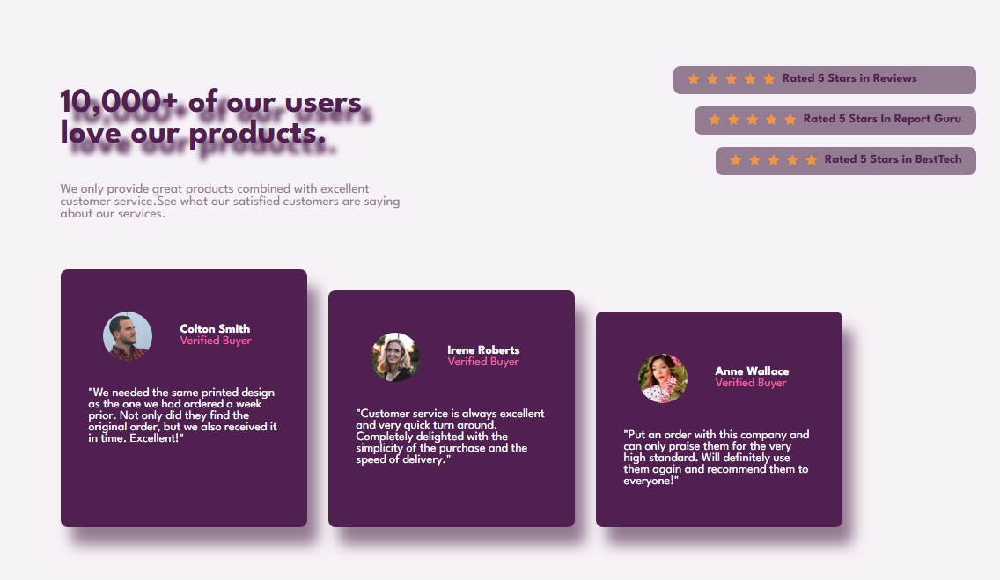

# Frontend Mentor - Social proof section solution

This is a solution to the [Social proof section challenge on Frontend Mentor](https://www.frontendmentor.io/challenges/social-proof-section-6e0qTv_bA). Frontend Mentor challenges help you improve your coding skills by building realistic projects. 

## Table of contents

- [Overview](#overview)
  - [The challenge](#the-challenge)
  - [Screenshot](#screenshot)
  - [Links](#links)
- [My process](#my-process)
  - [Built with](#built-with)
  - [What I learned](#what-i-learned)
  - [Continued development](#continued-development)
  - [Useful resources](#useful-resources)
- [Author](#author)
- [Acknowledgments](#acknowledgments)

**Note: Delete this note and update the table of contents based on what sections you keep.**

## Overview

I built a Social Proof Section inspired by a Frontend Mentor challenge. This section features an introductory text with rating cards showing user reviews and testimonials from verified buyers. The design visually highlights customer satisfaction and builds trust through star ratings and testimonials.

### The challenge

Layout choice:
At first, I was unsure whether to use Flexbox or CSS Grid for the layout. Since I had more experience with Flexbox, I decided to use it for this project. However, I would like to improve my skills in CSS Grid to handle similar layouts even more efficiently in the future.

Slanted and staggered blocks:
I wasn't sure how to create the effect where the <p> rating elements and the testimonial cards looked like they were slanting or staggered diagonally. After experimenting, I learned to achieve this using margin-left on the rating blocks and margin-top on the testimonial cards to create a "falling" or "cascading" effect.

### Screenshot




## My process

# Planning & layout structure

Defined the overall section layout and decided on using Flexbox for easier control.

Broke down the design into two main sections: introduction with ratings, and testimonials.

# Building the HTML structure

Created semantic markup using <section>, <div>, <h1>, <p>, <ul>, and <li>.

Grouped related content properly for easier styling.

# Styling with CSS

Used Flexbox to control column and row arrangements.

Added staggered margins to create the "slanting" visual effect.

Implemented box shadows for depth and modern look.

Applied colors, typography, and border-radius to match the design.

# Fine-tuning & responsiveness

Adjusted font sizes and spacing for better readability.

Ensured content looks visually balanced across screen sizes.

### Built with

- Semantic HTML5 markup — For clean and accessible structure.

- CSS custom properties & variables (if extended later).

- Flexbox — Main tool for layout arrangement and responsive adjustments.

- Box-shadow — To give depth to cards.

- Google Fonts — Imported League Spartan and Figtree for typography.

- Mobile-first workflow — Design and code adjustments optimized for various devices (even though this example focuses on desktop).

- Background images and gradients — For visual interest and branding consistency.

### What I learned

- How to use Flexbox gaps and margins creatively to create staggered visual effects.

- Improved understanding of semantic HTML and proper use of container elements.

- Gained confidence with box shadows to create depth in UI cards.

- Reinforced knowledge of responsive design considerations.

- To see how you can add code snippets, see below:

```html
<h1>Some HTML code I'm proud of</h1>
```
```css
.proud-of-this-css {
  color: papayawhip;
}
```
```js
const proudOfThisFunc = () => {
  console.log('🎉')
}
```

If you want more help with writing markdown, we'd recommend checking out [The Markdown Guide](https://www.markdownguide.org/) to learn more.

**Note: Delete this note and the content within this section and replace with your own learnings.**

### Continued development

Use this section to outline areas that you want to continue focusing on in future projects. These could be concepts you're still not completely comfortable with or techniques you found useful that you want to refine and perfect.

**Note: Delete this note and the content within this section and replace with your own plans for continued development.**

### Useful resources

- [Example resource 1](https://www.example.com) - This helped me for XYZ reason. I really liked this pattern and will use it going forward.
- [Example resource 2](https://www.example.com) - This is an amazing article which helped me finally understand XYZ. I'd recommend it to anyone still learning this concept.

**Note: Delete this note and replace the list above with resources that helped you during the challenge. These could come in handy for anyone viewing your solution or for yourself when you look back on this project in the future.**

## Author

- Frontend Mentor - [@jeff20501](https://www.frontendmentor.io/profile/jeff20501)
- github - [@jeff20501](https://github.com/jeff20501)

**Note: Delete this note and add/remove/edit lines above based on what links you'd like to share.**

## Acknowledgments

Special thanks to Kevin Powell's YouTube channel for guidance on CSS techniques like box shadows and layout tricks.
(https://www.youtube.com/watch?v=3elGSZSWTbM)

**Note: Delete this note and edit this section's content as necessary. If you completed this challenge by yourself, feel free to delete this section entirely.**
